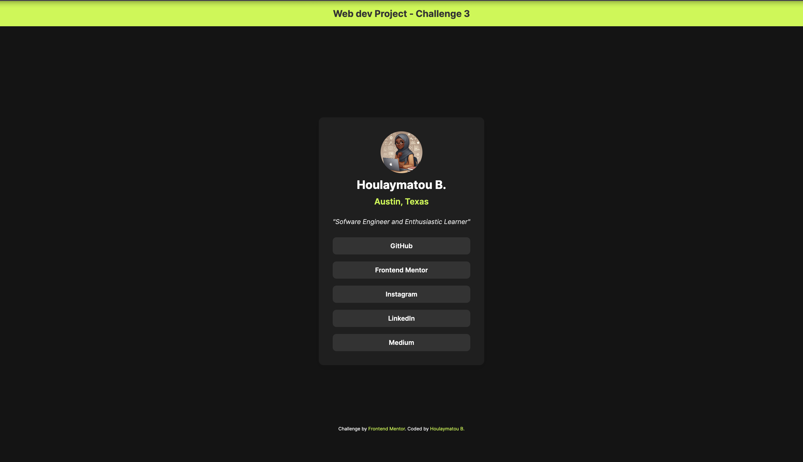

# Social Links Profile 📲

This is my solution to the [Social Links Profile Challenge on Frontend Mentor](https://www.frontendmentor.io/learning-paths/getting-started-on-frontend-mentor-XJhRWRREZd/steps/674e24aa92fdd6803cd0165f/challenge/refactor).

## Built With 🛠️

- Semantic HTML5
- CSS3 (Custom Properties, grid)
- Modern CSS Practices (e.g., CSS Variables for reusable colors)

## What I learned/practiced 📚

In this project, I focused on improving my front-end development skills and explored several key concepts:

### 1. CSS Grid Layout 🎨

I used **CSS Grid** to create a structured and responsive layout for the social links profile.  
CSS Grid allowed me to align elements easily, including centering the card within the viewport and organizing the social link buttons with consistent spacing.

I practiced grid properties like:

- `grid-template-columns` and `gap` for layout organization.
- `justify-items` and `align-items` to center content neatly.

### 2. Accessibility Improvements 🦾

I utilized semantic HTML tags like `<main>`, `<header>`, and `<footer>` to improve the accessibility and structure of the web page.  
This ensures better readability for screen readers and improves SEO.  
Additionally, I included proper **`alt` attributes** for images, ensuring that users relying on assistive technologies get a descriptive context.

### 3. Responsive Design 📱

I ensured the card layout works seamlessly on different screen sizes by:

- Setting a **maximum width** for the card.
- Using units like `rem`, `vh`, and `fr` for consistent spacing and responsiveness.

### 4. Styling and Hover States 🖱️

I implemented **hover effects** for the social links to enhance user interactivity and visual feedback.  
Buttons transition smoothly with a change in background color, creating a polished user experience.

### 5. Custom Fonts and Variables 🌟

I practiced using custom fonts through `@font-face` and applied a consistent typography hierarchy.  
I used **CSS variables** to manage colors and font sizes, improving the maintainability and scalability of the project.
